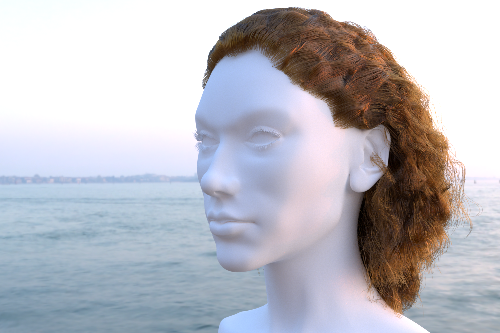

# Microfacet-base Hair Scattering Model in Mitsuba 2

## Overview
This code base includes the implementation of the EGSR 2022 paper **A Microfacet-based Hair Scattering Model** in [Mitsuba 2](https://mitsuba2.readthedocs.io/en/latest/index.html).
## Instruction
- Clone the [Mitsuba Renderer 2](git@github.com:mitsuba-renderer/mitsuba2.git) repository.
- Copy the current folder to the repository.
- Add this line to `src/bsdfs/CMakeLists.txt`:
```cmake
add_plugin(roughhair            roughhair.cpp)
```
Add to `src/shapes/CMakeLists.txt`:
```cmake
add_plugin(hair             hair.cpp)
add_plugin(hairsegment      hairsegment.cpp)
```
Then compile as instructed in the [Mitsuba 2 Docs](https://mitsuba2.readthedocs.io/en/latest/index.html).
## Usage
in the `build` folder, execute `dist/mitsuba ../hair_scenes/xxx.xml`
## Note
- PDF is not implemented for elliptical cross-sections
- Checkout main branch for hair with circular cross-sections
- In Mitsuba 2, $\omega_i$ denotes the camera ray and $\omega_o$ the light ray. Therefore, for elliptical cross-sections, these two components are swapped in `roughhair.cpp`.
